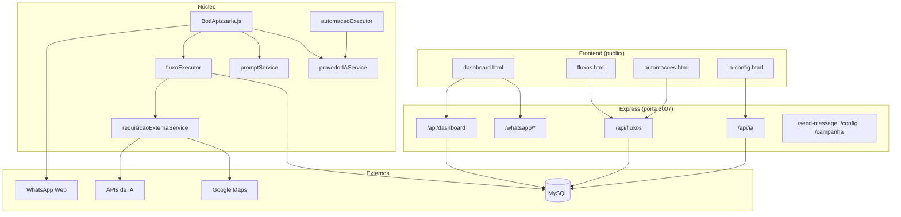

# Arquitetura

## Visão geral



## Estrutura de diretórios

```
pizzaria_bot/
├── BotIApizzaria.js          # Entry point
├── historico.js              # Sessões de atendimento IA
├── ias.js                    # Clientes IA legados (fallback)
├── contexto.js               # Contexto conversas_atuais
│
├── public/                   # Frontend estático
│   ├── dashboard.html
│   ├── fluxos.html
│   ├── automacoes.html
│   └── ia-config.html
│
├── routes/
│   ├── dashboardRoutes.js    # /api/dashboard/*
│   ├── iaRoutes.js           # /api/ia/*
│   └── fluxoRoutes.js        # /api/fluxos/*
│
├── services/                 # Lógica de negócio
│   ├── configuracaoService.js
│   ├── grupoWhatsappService.js
│   ├── gatilhoService.js
│   ├── contatoService.js
│   ├── promptService.js
│   ├── provedorIAService.js
│   ├── requisicaoExternaService.js
│   ├── arquivoService.js
│   ├── fluxoService.js
│   ├── fluxoExecutor.js      # Motor fluxos WhatsApp
│   ├── fluxoLogService.js
│   ├── automacaoExecutor.js  # Motor automações HTTP
│   ├── indicacaoService.js
│   ├── metaService.js
│   ├── whatsappIdentityService.js
│   ├── clienteService.js
│   └── pedidosService.js
│
├── Models/                   # Sequelize ORM
├── database/
│   ├── connection.js
│   ├── setup.js
│   ├── create-database.js
│   └── migrations/
│
├── arquivos/                 # JSON estático (cardápio)
├── utils/                      # Helpers globais
└── docs/                       # Esta documentação
```

## Pipeline de mensagens WhatsApp

```
Mensagem recebida
  │
  ├─ Ignora: grupos, status@broadcast, fromMe, vazio
  │
  ├─ vCard → fluxo wait_contacts OU campanha Missão 2
  │
  ├─ Gatilho fluxo visual (DB) → fluxoExecutor.iniciarFluxo()
  │
  ├─ Gatilho campanha_desconto → processarCampanhaDesconto()
  │
  └─ Debounce (configurável, padrão 10s)
       ├─ modo fluxo → fluxoExecutor.processarMensagemFluxo()
       ├─ modo campanha → processarCampanhaDesconto()
       └─ modo atendimento → processarMensagem() + IA dinâmica
```

## Camadas de responsabilidade

| Camada | Responsabilidade |
|--------|------------------|
| **BotIApizzaria.js** | Eventos WhatsApp, debounce, campanha legada, rotas raiz |
| **routes/** | HTTP REST, validação básica, resposta JSON |
| **services/** | Regras de negócio, acesso ao banco, execução |
| **Models/** | Definição Sequelize das entidades |
| **public/** | UI administrativa (JS inline) |
| **arquivos/** | Dados estáticos de cardápio |

## Persistência

| Dado | Onde |
|------|------|
| Configurações, fluxos, prompts | MySQL (Sequelize) |
| Sessão WhatsApp | `.wwebjs_auth/` (filesystem) |
| Sessões campanha | Memória (`Map` em BotIApizzaria.js) |
| Histórico atendimento IA | MySQL + cache em memória (`historico.js`) |
| Cardápio | JSON em `arquivos/` + metadados `_meta.json` |

## Injeção de dependências

O client WhatsApp é injetado nas rotas do dashboard após evento `ready`:

```javascript
// BotIApizzaria.js
setWhatsappClient(client);
```

Isso permite sincronizar grupos e expor status de conexão via API.

## Padrões adotados

- **Services** encapsulam CRUD e lógica; routes são finas
- **Prompts** no banco com fallback em `utils/prompts.js`
- **Provedor IA** dinâmico com fallback em `ias.js` (Qwen hardcoded)
- **Fluxos** armazenados como JSON (nodes + edges + viewport)
- **Logs de fluxo** em tabela dedicada `fluxo_exec_logs`
