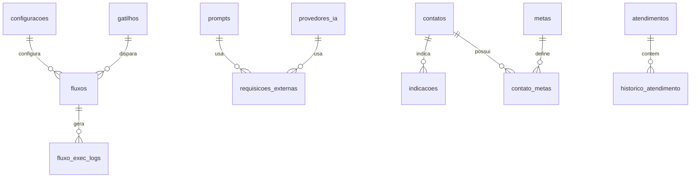

# Banco de Dados

**SGBD:** MySQL  
**ORM:** Sequelize 6  
**Configuração:** `database/connection.js` (via `.env`)  
**Setup:** `database/setup.js` + migrações em `database/migrations/`

---

## Diagrama simplificado



---

## Tabelas principais (Sequelize sync)

### `configuracoes`

Configurações chave-valor do sistema.

| Coluna | Tipo | Descrição |
|--------|------|-----------|
| id | INT PK | — |
| chave | VARCHAR UNIQUE | Identificador |
| valor | TEXT | Valor serializado |
| tipo | ENUM | boolean, string, number, json |
| categoria | VARCHAR | Agrupamento UI |
| descricao | TEXT | Texto de ajuda |

### `fluxos`

Fluxos conversacionais e automações.

| Coluna | Tipo | Descrição |
|--------|------|-----------|
| id | INT PK | — |
| nome | VARCHAR | Nome exibido |
| descricao | TEXT | — |
| tipo | ENUM | atendimento, campanha, automacao, suporte |
| gatilho | JSON | Palavras-chave / mensagem exata |
| nodes | JSON | Nós do editor visual |
| edges | JSON | Conexões entre nós |
| viewport | JSON | Posição/zoom do canvas |
| ativo | BOOLEAN | Se executa |
| versao | INT | Controle de versão |

### `grupos_whatsapp`

Grupos sincronizados do WhatsApp.

| Coluna | Tipo | Descrição |
|--------|------|-----------|
| id | INT PK | — |
| grupoId | VARCHAR UNIQUE | ID WhatsApp do grupo |
| nome | VARCHAR | Nome do grupo |
| bairro | VARCHAR | Bairro mapeado |
| linkConvite | TEXT | Link de convite |
| participantes | INT | Quantidade |
| tipo | VARCHAR | Tipo/categoria |
| ativo | BOOLEAN | Participa da campanha |
| isGrupoGeral | BOOLEAN | Fallback |
| ultimaSincronizacao | DATETIME | — |

### `gatilhos`

Gatilhos de texto para campanha/atendimento.

| Coluna | Tipo | Descrição |
|--------|------|-----------|
| id | INT PK | — |
| nome | VARCHAR UNIQUE | Identificador |
| tipo | VARCHAR | campanha, atendimento, etc. |
| palavrasChave | JSON | Array de palavras |
| mensagemExata | TEXT | Match exato |
| ativo | BOOLEAN | — |
| prioridade | INT | Ordem de avaliação |
| configuracoes | JSON | Extras |

### `prompts`

Prompts de IA editáveis.

| Coluna | Tipo | Descrição |
|--------|------|-----------|
| id | INT PK | — |
| nome | VARCHAR UNIQUE | Identificador |
| descricao | TEXT | — |
| tipo | VARCHAR | atendimento, analise, campanha, etc. |
| conteudo | TEXT | Corpo do prompt |
| variaveis | JSON | Variáveis substituíveis |
| ativo | BOOLEAN | — |
| versao | INT | — |

### `provedores_ia`

APIs de inteligência artificial.

| Coluna | Tipo | Descrição |
|--------|------|-----------|
| id | INT PK | — |
| nome | VARCHAR UNIQUE | Identificador |
| descricao | TEXT | — |
| tipo | VARCHAR | alibaba, openrouter, openai |
| baseUrl | VARCHAR | URL da API |
| apiKey | VARCHAR | Chave (sensível) |
| modeloPadrao | VARCHAR | Modelo default |
| modelos | JSON | Lista de modelos |
| configuracoes | JSON | Extras |
| ativo | BOOLEAN | — |
| isPrincipal | BOOLEAN | Provedor default |

### `requisicoes_externas`

Handlers de ações externas (cardápio, taxa, etc.).

| Coluna | Tipo | Descrição |
|--------|------|-----------|
| id | INT PK | — |
| nome | VARCHAR UNIQUE | Nome amigável |
| tipo | VARCHAR UNIQUE | Identificador (ex.: taxa_entrega) |
| descricao | TEXT | — |
| tipoHandler | ENUM | ia, api, json, funcao |
| promptId | INT FK | Prompt (se handler ia) |
| provedorId | INT FK | Provedor (se handler ia) |
| endpoint | VARCHAR | URL (se handler api) |
| metodo | VARCHAR | GET, POST, etc. |
| headers | JSON | Headers HTTP |
| arquivoJson | VARCHAR | Nome em arquivos/ |
| funcaoNome | VARCHAR | Nome da função JS |
| parametros | JSON | Schema de parâmetros |
| ativo | BOOLEAN | — |

---

## Tabelas de migração / SQL manual

### `fluxo_exec_logs`

Auditoria de execução de fluxos (criada em `setup.js`).

| Coluna | Tipo | Descrição |
|--------|------|-----------|
| id | BIGINT PK | — |
| whatsapp_id | VARCHAR(50) | Número normalizado |
| chat_id | VARCHAR(80) | ID completo do chat |
| fluxo_id | INT | FK lógica |
| fluxo_nome | VARCHAR(150) | — |
| node_id | VARCHAR(80) | Nó executado |
| node_type | VARCHAR(50) | Tipo do nó |
| evento | VARCHAR(50) | info, erro, etc. |
| mensagem | TEXT | — |
| detalhes_json | JSON | Dados extras |
| created_at | TIMESTAMP | — |

Índices: `(whatsapp_id, created_at)`, `(fluxo_id, created_at)`

### `contatos`

CRM parcial — ver também [CONTATOS_TABELA.md](./CONTATOS_TABELA.md).

| Coluna | Tipo | Descrição |
|--------|------|-----------|
| id | INT PK | — |
| whatsapp_id | VARCHAR UNIQUE | Só dígitos |
| whatsapp_lid | VARCHAR(80) | ID @lid (privacidade) |
| nome | VARCHAR | — |
| cam_grupo | TINYINT | Missão 1 concluída |
| id_negociacao | INT | ID no CRM externo |
| qt_indicados | INT | Total indicações |
| cam_indicacoes | TINYINT | Missão 2 concluída |

> **Atenção:** o projeto só faz **UPDATE** em `contatos`, nunca INSERT. Linhas devem ser criadas por CRM externo.

### `indicacoes`

Registro de indicações da campanha.

| Coluna | Tipo | Descrição |
|--------|------|-----------|
| id | INT PK | — |
| indicador_whatsapp_id | VARCHAR | Quem indicou |
| indicado_numero | VARCHAR | Número indicado |
| indicado_nome | VARCHAR | Nome indicado |
| created_at | TIMESTAMP | — |

Unique: `(indicador_whatsapp_id, indicado_numero)`

### `metas`

Metas gamificadas.

| Coluna | Tipo | Descrição |
|--------|------|-----------|
| id | INT PK | — |
| nome | VARCHAR UNIQUE | entrada_grupo, 10_indicacoes, etc. |
| descricao | TEXT | — |
| ativo | BOOLEAN | — |

### `contato_metas`

Progresso por contato.

| Coluna | Tipo | Descrição |
|--------|------|-----------|
| id | INT PK | — |
| whatsapp_id | VARCHAR | — |
| meta_id | INT FK | → metas |
| concluido | BOOLEAN | — |
| concluido_em | DATETIME | — |

### `webhook_eventos`

Captura crua de webhooks de sistemas externos para estudo dos payloads (hoje: Multipedidos — ver [doc 17](./17-integracao-multipedidos.md)).

| Coluna | Tipo | Descrição |
|--------|------|-----------|
| id | INT PK | — |
| origem | VARCHAR(40) | Sistema que enviou (`multipedidos`) |
| metodo | VARCHAR(10) | Método HTTP |
| caminho | VARCHAR(255) | Sub-caminho após o segredo |
| query_string | TEXT | — |
| content_type | VARCHAR(120) | — |
| headers | LONGTEXT | JSON dos headers |
| body | LONGTEXT | Corpo cru, como recebido |
| body_json_valido | BOOLEAN | Corpo é JSON válido |
| ip | VARCHAR(64) | — |
| recebido_em | TIMESTAMP | — |

---

## Tabelas legadas

Models em `Models/` com conexão Sequelize **hardcoded** em `localhost` (diferente de `database/connection.js`):

### `atendimentos`

| Coluna | Tipo | Descrição |
|--------|------|-----------|
| id | UUID PK | — |
| numero | VARCHAR | Telefone |
| iniciado_em | DATETIME | — |
| finalizado_em | DATETIME | — |
| status | ENUM | aberto, finalizado |

### `historico_atendimento`

| Coluna | Tipo | Descrição |
|--------|------|-----------|
| id | INT PK | — |
| atendimento_id | UUID FK | — |
| numero | VARCHAR | — |
| role | VARCHAR | user, assistant |
| content | TEXT | Mensagem |

### `clientes`

Cadastro completo de clientes (CRM legado).

Campos: nome, telefone, email, endereço, ticket_medio, total_faturado, compras, ultimo_pedido, pontos, preferencias, etc.

### `pedidos`

Pedidos completos com total, taxa_entrega, bairro, detalhes, status_pedido, etc.

### `conversas_atuais`

| Coluna | Tipo | Descrição |
|--------|------|-----------|
| telefone | VARCHAR PK | — |
| contexto | TEXT | JSON de contexto |
| etapa | VARCHAR | Etapa do funil |
| atualizado_em | DATETIME | — |

---

## Migrações

| Arquivo | Tabelas |
|---------|---------|
| `migrations/indicacoes.js` | `contatos`, `indicacoes` |
| `migrations/metas.js` | `metas`, `contato_metas` + seeds |
| `migrations/2026-09-20-webhook-eventos.js` | `webhook_eventos` |

Executadas via `run-setup.js` ou manualmente.

## Seeds (setup.js)

Insere automaticamente se não existir:

- 10 configurações padrão
- Gatilho `campanha_desconto`
- 2 provedores IA
- 4 prompts padrão
- 7 requisições externas

## Comandos úteis

```bash
# Sync tabelas + seeds
npm run setup

# Criar banco
node database/create-database.js

# Setup completo
npm run setup:first
```
