# Evolução e Etapas do Projeto

Histórico reconstruído a partir da estrutura do código, comentários, arquivos legados e funcionalidades atuais.

---

## Linha do tempo

```mermaid
timeline
  title Evolução do Pizzaria Bot
  section Fase 1 — Bot básico
    Bot monolítico : BotIcopia.js
    IA hardcoded : ias.js + utils/prompts.js
    Cardápio JSON : arquivos/
  section Fase 2 — Atendimento IA
    BotIApizzaria.js : Pipeline completo
    Histórico sessões : historico.js + atendimentos
    Google Maps : utils/global.js
    Requisições externas : interpretarRespostaAssistente
  section Fase 3 — Campanha
    Campanha 30% : sessoesCampanha Map
    Grupos por bairro : grupos_whatsapp DB + JSON
    Indicações vCard : indicacaoService
    Metas gamificadas : migrations/metas.js
  section Fase 4 — Dashboard
    Express + rotas REST : routes/
    Services layer : 17 serviços
    Dashboard HTML : public/dashboard.html
    Config no banco : configuracoes
  section Fase 5 — Config dinâmica
    Prompts no DB : promptService
    Provedores IA : provedorIAService
    Requisições configuráveis : requisicaoExternaService
    Editor cardápio : ia-config.html
  section Fase 6 — Fluxos visuais
    Editor drag-drop : fluxos.html
    Motor execução : fluxoExecutor.js
    Logs auditoria : fluxo_exec_logs
    Handoff campanha : setOnCampanhaFlowEnd
  section Fase 7 — Automações
    Editor automações : automacoes.html
    Motor HTTP : automacaoExecutor.js
    Webhook/run : fluxoRoutes
  section Fase 8 — CRM parcial
    Tabela contatos : migrations/indicacoes.js
    whatsapp_lid : privacidade WhatsApp
    Dashboard contatos : viewContatos
```



---

## Fase 1 — Bot básico (legado)

**Arquivos:** `BotIcopia.js`, `ias.js`, `utils/prompts.js`

### Características
- Bot WhatsApp simples com endpoint `/send-message`
- Prompts em arquivo JavaScript estático
- IA Qwen/Claude com URLs e keys hardcoded
- Sem banco de dados configurável
- Sem dashboard

### Estado atual
`BotIcopia.js` mantido como referência — **não usado em produção**.

---

## Fase 2 — Atendimento IA estruturado

**Arquivos:** `BotIApizzaria.js`, `historico.js`, `utils/global.js`

### Entregas
- Pipeline de mensagens com debounce
- Sessões de atendimento (`atendimentos` + `historico_atendimento`)
- Integração Google Maps para taxa de entrega
- Interpretação de respostas IA → ações (cardápio, bordas, finalizar)
- Horário de funcionamento
- Endpoint `/send-message` para sistemas externos

### Decisões técnicas
- Express na mesma processo do bot WhatsApp
- Cache de histórico em memória + persistência MySQL
- Cardápio permanece em JSON (flexibilidade)

---

## Fase 3 — Campanha gamificada

**Arquivos:** lógica em `BotIApizzaria.js`, `indicacaoService.js`, migrações

### Entregas
- Campanha "até 30% de desconto" em 3 missões
- Missão 1: entrar no grupo WhatsApp por bairro
- Missão 2: enviar 10 contatos (vCard)
- Gatilho `campanha_desconto` seed no banco
- Tabelas `contatos`, `indicacoes`, `metas`, `contato_metas`
- Sessões campanha em memória (`Map`)

### Pendências herdadas
- Missão 3 não implementada
- Contatos dependem de sistema externo para INSERT

---

## Fase 4 — Dashboard administrativo

**Arquivos:** `public/dashboard.html`, `routes/dashboardRoutes.js`, `services/*`

### Entregas
- Interface web com Bootstrap 5 (tema escuro)
- CRUD grupos WhatsApp com sync do client
- CRUD gatilhos
- Configurações editáveis por categoria
- Status WhatsApp + QR code na UI
- Arquitetura services + routes

### Multi-instância
- `.env` por empresa (PORT, DB_NAME, PM2_APP_NAME)
- Scripts `setup.ps1`, `setup.sh`, `run-setup.js`

---

## Fase 5 — Configuração dinâmica de IA

**Arquivos:** `ia-config.html`, `iaRoutes.js`, models de IA

### Entregas
- Prompts editáveis no banco (fallback arquivo)
- Múltiplos provedores IA (Qwen, OpenRouter)
- Requisições externas configuráveis (4 handlers)
- Editor de arquivos JSON do cardápio
- Teste de IA no dashboard
- Seeds automáticos no setup

### Impacto
Operador pode ajustar comportamento do bot **sem deploy de código**.

---

## Fase 6 — Editor visual de fluxos

**Arquivos:** `fluxos.html`, `fluxoExecutor.js`, `fluxoService.js`

### Entregas
- Canvas drag-and-drop com 9 tipos de nós
- Fluxos salvos como JSON no banco
- Execução stateful por chat WhatsApp
- Variáveis de sessão entre nós
- Logs detalhados (`fluxo_exec_logs`)
- Import/export JSON
- Handoff fluxo visual → campanha legada
- Suporte a `@lid` (whatsappIdentityService)

### Tipos de fluxo
`atendimento`, `campanha`, `suporte`

---

## Fase 7 — Automações HTTP

**Arquivos:** `automacoes.html`, `automacaoExecutor.js`

### Entregas
- Editor separado para fluxos tipo `automacao`
- 10 tipos de nós (webhook, HTTP, IA, sleep, etc.)
- Disparo via `POST /:id/webhook` e `POST /:id/run`
- Desacoplamento total do WhatsApp
- Script `teste-webhook.js`

### Caso de uso
Integrações back-office (ERP, pagamento, logística) sem passar pelo chat.

---

## Fase 8 — CRM parcial e identidade

**Arquivos:** `contatoService.js`, `metaService.js`, migrações

### Entregas
- View Contatos no dashboard
- Logs de fluxo por contato
- Coluna `whatsapp_lid` para privacidade WhatsApp
- Documentação `CONTATOS_TABELA.md`
- Ações de fluxo: ler contato, marcar/verificar meta

### Limitação conhecida
Sem INSERT automático — integração CRM externa necessária.

---

## Arquitetura atual (v1.0.0)

```
┌─────────────────────────────────────────────────────┐
│                   BotIApizzaria.js                   │
│  WhatsApp ◄──► Pipeline ◄──► Express ◄──► MySQL     │
└─────────────────────────────────────────────────────┘
         │              │              │
    fluxoExecutor  automacaoExecutor  Services
         │              │              │
    fluxos.html   automacoes.html  dashboard.html
                                      ia-config.html
```

**Total:** ~73 arquivos, 17 services, 4 páginas web, 3 routers REST.

---

## Próxima fase esperada (v1.1)

Com base no [Roadmap](./10-roadmap.md):

1. Completar Missão 3
2. INSERT automático de contatos
3. Persistir sessões campanha
4. Segurança (auth dashboard, keys no .env)
5. Unificar models legados

---

## Convenções estabelecidas

| Convenção | Exemplo |
|-----------|---------|
| Services em camelCase | `grupoWhatsappService.js` |
| Models PascalCase | `ConfiguracaoModel.js` |
| Rotas prefixadas | `/api/dashboard`, `/api/ia`, `/api/fluxos` |
| Config chave snake_case | `atendimento_automatico` |
| WhatsApp ID só dígitos | `5511999999999` |
| Fluxos JSON | nodes + edges + viewport |
| Resposta API | `{ success, data/error }` |
